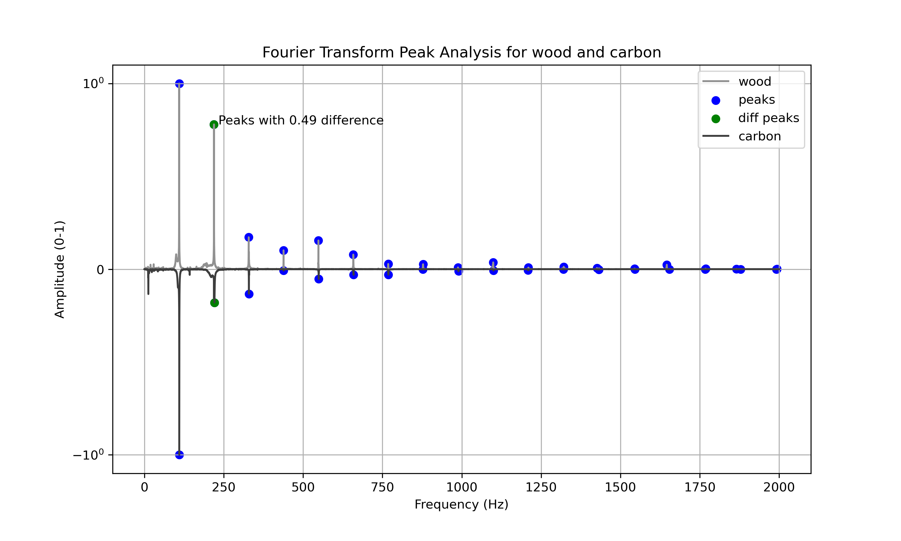

# Summary

Guitarsounds allows rapidly visualizing relevant features of harmonic sounds, enabling the comparison of musical instrument design iterations.
Guitarsounds implements common signal processing techniques, such as the Fourier transform and augments them to allow for a meaningful analysis of transient harmonic sounds, such as sounds having a defined onset and a frequency-amplitude distribution concentrated around well defined partials.
As an example, the log-time envelop of a sound filtered within a specific frequency bandwidth allows the comparison of the dynamic response of two instruments for a specific frequency range. 
The guitarsounds package is divided in two main components, a simple object oriented advanced programming interface (API) which can be used to extract features from sounds and visualize them according to the experimenter's needs and a graphical user interface (GUI) from which all the features of guitarsounds can be accessed by users less knowledgeable in programming. 
Guitarsounds is meant to be used with the Jupyter Notebook interface as to allow interactively exploring the sound data, either with the API or the GUI.

The main features of guitarsounds are: 

- Load and save sounds to and from the WAVE file format
- Automated Conditioning and normalization of loaded sounds to allow for a meaningful comparison
- Visualization of  different features of the sounds, among them which are relevant to musical instrument design: 
    - Linear and logarithmic time envelop
    - Octave bins Fourier transform
    - Fourier transform peaks
    - Time dependent damping
- Divide sounds in frequency bins to analyze variations in temporal behaviour for different frequency ranges
- Extract the Fourier transform peaks of an harmonic signal using a custom peak finding algorithm
- Extract numerical values of certain features such as the Helmholtz cavity frequency of a guitar or an estimation of the fundamental frequency of a signal
- Provide a easy to use signal processing API to extract new features according to specific needs which deals with lower level features such as the soundfile sample rate

An example code snippet which compares the Fourier transform peaks of two signals is presented below with the associated output in \autoref{fig:fft-comp}. Both sounds are loaded from wave files, conditioned by setting the signal onset at a specific value from the signal start and trimming the signal according to its fundamental. The SoundPack object was created to easily compare a set of sounds. Different features are available when instantiating the SoundPack with two and more than two sounds. The matplotlib python package is used to visualize the sound features, thus the figures created by guitarsounds can be accessed to modify or save them. 

```python
import guitarsounds
import matplotlib.pyplot as plt

file1 = 'example_sounds/Wood_Guitar/Wood_A5.wav'
file2 = 'example_sounds/Carbon_Guitar/Carbon_A5.wav'
mysounds = guitarsounds.SoundPack(file1, file2, names=['wood', 'carbon'])
mysounds.compare_peaks()

plt.gcf().savefig('peak_comparison')
```



# Statement of need

Guitarsounds was written to meet the needs of the Bruant lutherie school, more precisely as a tool to visualize and compare the sounds of different guitar designs based on arbitrary sound features. The guitarsounds API serves as a introduction to programming for data analysis for the school's students and the GUI allows visualizing sound features even for users with minimal affinity with computers, as such is the case for some students. More over, the guitarsounds package is used in the teaching activities as a tool to visualize the physical phenomenons involved in the sound produced by guitars, such as the hemlotz cavity frequency of the instrument. The GUI was included in the package as knowledge or interest in programming is not expected in the luthier's training. A screen capture of the GUI is shown in \autoref{fig:gui}. The design of guitarsounds differs from existing packages in its ability to be both used alone to produce decent figures with a minimal number of lines of code and as a tool in a python data visualization stack where the sound specific needs can be handled by guitarsounds. More over, the GUI acts as a different way of using the same tool in the same environment (Jupyter Notebook) as to allow for institutional uniformity in teaching and experimentation. There exists overlap between guitarsounds and the librosa [mMcFee:2015] python package for music analysis, however librosa is not a dependency of guitarsounds and the latter is more focused on feature extraction for machine learning application and lacks features tailored for harmonic sound analysis and  integrated comparison of sounds. Librosa is also aimed at an audience with a more developed knowledge of python programming.

{width=50%}

# References
