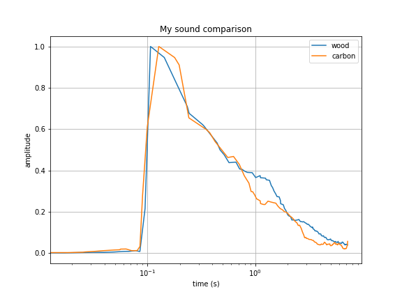

--
title: 'Guitarsounds : A Python package to visualize harmonic sounds for musical instrument testing'
tags:
  - Python
  - signal processing
  - musical instrument
  - harmonic sound
authors:
  - name: Olivier Chabot
    orcid: 0000-0003-3294-2812
    equal-contrib: false
    affiliation: 1
  - name: Louis Brillon
    equal-contrib: false
    affiliation: 1
affiliations:
 - name: École de lutherie Bruand, Montréal, QC, Canada
   index: 1
date: 15 September 2022
bibliography: paper.bib
---

# Summary

The `guitarsounds` Python package can be used to rapidly visualize relevant features of harmonic sounds and is mainly developed to compare musical instrument design iterations. 
`guitarsounds` is wrapped around the implementation of common signal processing features. 
The implementations used in the `guitarsounds` package are manly taken from `numpy` [@harris_array_2020] and `scipy` [@virtanen_scipy_2020]. 
The signal processing features are augmented to perform the analysis of transient harmonic sounds.
Such sounds are defined as having a defined onset, and a frequency-amplitude distribution clearly concentrated around defined partials. 
Consequently, while the package is named `guitarsounds`, its analysis framework can be used with any harmonic sound, such as those produced by a piano, or a percussion instrument. 

The guitarsounds package is divided in two main components. 
First, the package is developped around a convenient object oriented Application Programming Interface (API) which can be used to extract features from sounds and visualize them according to the user's needs. 
Then, a graphical user interface (GUI) makes all the features of `guitarsounds` available to users less knowledgeable in programming. 
`guitarsounds` is meant to be used with the Jupyter Notebook interface as to allow interactively exploring the sound data, either with the API or the GUI.

The main features of guitarsounds are: 

- Automate the loading, conditioning and normalization of multiple sound files to meaningfully compare their features.
- Visualize sounds features relevant to musical instrument design, such as: 
    - Linear and logarithmic time envelope
    - Octave bands Fourier transform
    - Time dependent damping
- Divide sounds in frequency bands to analyze variations in temporal behaviour for different frequency ranges.
- Extract the Fourier transform peaks of a harmonic signal using a custom peak finding algorithm.
- Extract numerical values for certain features such as the Helmholtz cavity frequency of a guitar.
- Provide an easy-to-use signal processing API to compute new features meeting to specific needs by providing acess to lower level features and handling the differences between sound files, such as the file sample rate.

Specifically, the API provides 5 classes nested together : `SoundPack`, `Sound`, `Signal`, `Plot`. 
Starting from the innermost class, the `Plot` class handles the low level plotting of specific features, such as plotting the FFT for a single sound file.
The `Signal` class is used to store the data of an array corresponding to a single signal. 
For example, if a sound file is read and filtered, the array resulting from the filtering operation will be stored in a new instance of the `Signal` class. 
An instance of the `Plot` class is constructed for each `Signal` class instance and stored as an attribute of the `Signal` class. 
The `Signal` class provides all the features relying only on the data of a single sound signal as class methods. 
The `Sound` class is used to store all the information corresponding to a single sound file. 
When a `.wav` file is read, all the processing is handled by the `Sound` class, such as truncating, filtering or normalizing the sound signal. 
The `Sound` class provides the features relying on more than one `Signal` instance, but still using the information from a single sound file, such as the power distribution of a sound across different frequency bands. 
Finally, the `SoundPack` class is constructed from multiple `Sound` class instances and provides the features used to compare the data between different sound files. 
The `SoundPack` methods are divided between methods developed to compare two sounds and methods developed to compare an arbitrary amount of sounds. 
As an example, the method plotting the FFT of two sounds in a mirror configuration can only be called if the `SoundPack` was constructed using exactly two sounds, whereas the method showing a table of the different sound fundamental frequencies can be called for a `SoundPack` instance created using an arbitrary number of `Sounds`.

As an example, the log-time envelope, a feature describing the amplitude of a sound with a higher refinement in time at the start of the sound, can be computed for a sound filtered within a specific frequency bandwidth. 
By plotting this feature for the same note played on two instruments, the dynamic response of the instruments can be compared for a specific frequency range.
A code snippet comparing the log-time envelope of two sounds is presented below with the associated output in \autoref{fig:log-comp}.
In the following code, the `SoundPack` object is first instantiated from the specified sound files. 
For each file, a `Sound` class instance is created and conditioned. 
In the conditioning procedure, the signal is first resampled to have a sample rate of 22050, this is important to ensure all the features compared between sounds are computed using the same sample rate. 
The sound is then trimmed so that the beginning of the onset is at 1 ms, as can be seen on fibure \autoref{fig:log-comp}. 
To ensure compared sounds have the same length, the end of the sounds is trimmed so that each sound has the same number of samples as the shortest sound.
When a single `Sound` is instantiated, the end of the sound can be trimmed according to its fundamental frequency by setting the key-word argument `auto_trim=True` in the `condition` method. 
By using this functionality, sounds having an higher fundamental frequency will be trimmed to a shorter length, as they thend to decay at a faster rate.
The `guitarsounds` package relies on `matplotlib` [@hunter_matplotlib_2007] for all its vizualisation features. Thus, users familiar with the `matplotlib` objects can tune the figures created by `guitarsounds` to their needs.
 

```python
import guitarsounds
import matplotlib.pyplot as plt

# Use guitarsound to compare the log-time envelope of two sounds
soundfile1 = "example_sounds/Wood_Guitar/Wood_A5.wav"
soundfile2 = "example_sounds/Carbon_Guitar/Carbon_A5.wav"
mysounds = guitarsounds.SoundPack(soundfile1, soundfile2, names=["wood", "carbon"])
mysounds.plot("log envelop")

# Access the matplotlib Figure and Axes objects created by guitarsounds
plt.gca().set_title("My sound comparison") # To change the title
plt.gcd().savefig("log_envelope_compare") # To save the figure
```



# Statement of need

Guitarsounds was written to meet the needs of the Bruand lutherie school, more precisely as a tool to visualize and compare the sounds of different guitar designs based on arbitrary sound features.
As such, the guitarsounds package was used in previous academic work (in press) to investigate the sound differences between two guitar designed using an innovative numerical prototyping method based on topological optimization. 
In the scope of this research, guitarsounds allowed the measurement of specific sound features such as the slope of the peaks in the signal Fourier transform, computed using a linear regression. 
As this feature is related to the instrument's tone [@sumi_classical_2008], it was usefull in highlighting the differences between the two guitar designs.
 `guitarsounds` is also used in ongoing research at the Bruand lutherie school to manage sound data in a project where guitar sounds are generated with random vaules for specific features, to provide data for a psychoacoustic study. 
The `guitarsounds` API is also used as an introduction to programming for data analysis for the school's students, and the GUI allows visualizing sound features even for users with minimal affinity with computers, as it is the case for some students. 
Moreover, the guitarsounds package is used in the teaching activities as a tool to visualize the physical phenomena involved in the sounds produced by guitars, such as the Hemlotz cavity frequency of an instrument. 
The GUI was included in the package as knowledge or interest in programming isn't expected in the luthier's training. 
A screen capture of the GUI is shown in \autoref{fig:gui}. 
The design of guitarsounds differs from existing packages in its ability to be both used alone to produce decent figures with a minimal number of lines of code and as a tool in a Python data visualization stack where the sound specific needs can be handled by guitarsounds. 
Moreover, the GUI provides an alternative way of using the same tool in the same environment (Jupyter Notebook) which allows all users to use the same framework in teaching and experimentation. 
There exists overlap between `guitarsounds`, and the `librosa` [@Librosa] Python package for music analysis, however `librosa` is not a dependency of `guitarsounds`, and the latter is more focused on feature extraction for machine learning application and lacks features tailored to harmonic sound analysis and  integrated comparison of sounds. 
The  `librosa` package is also aimed at an audience with a more developed knowledge of Python programming.

{width=50%}

# References
